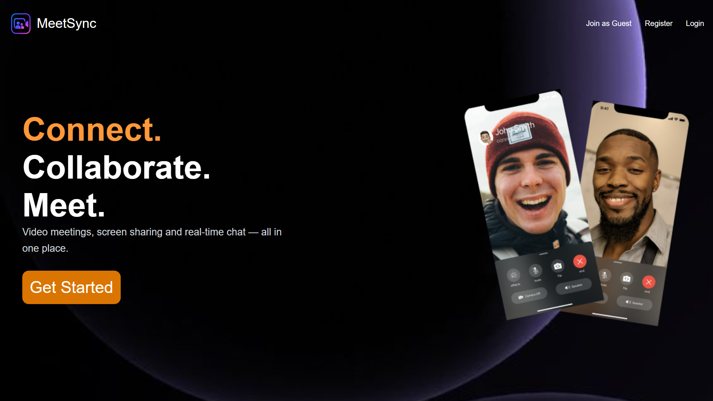
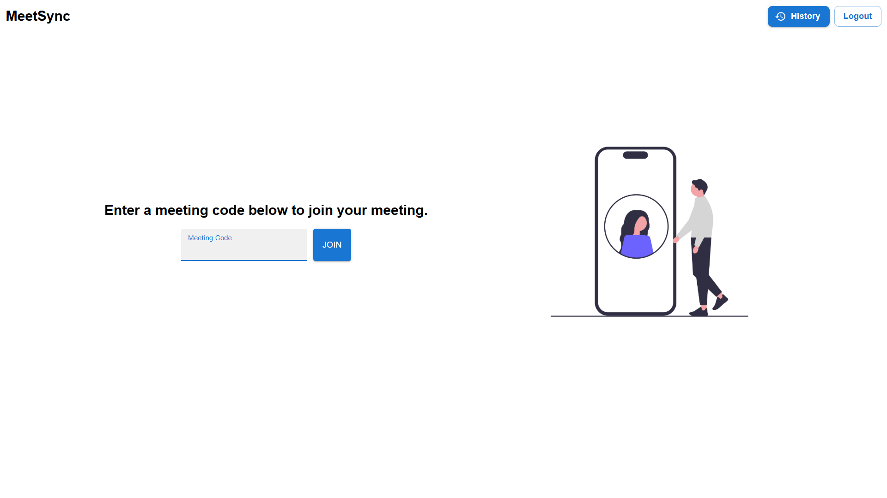
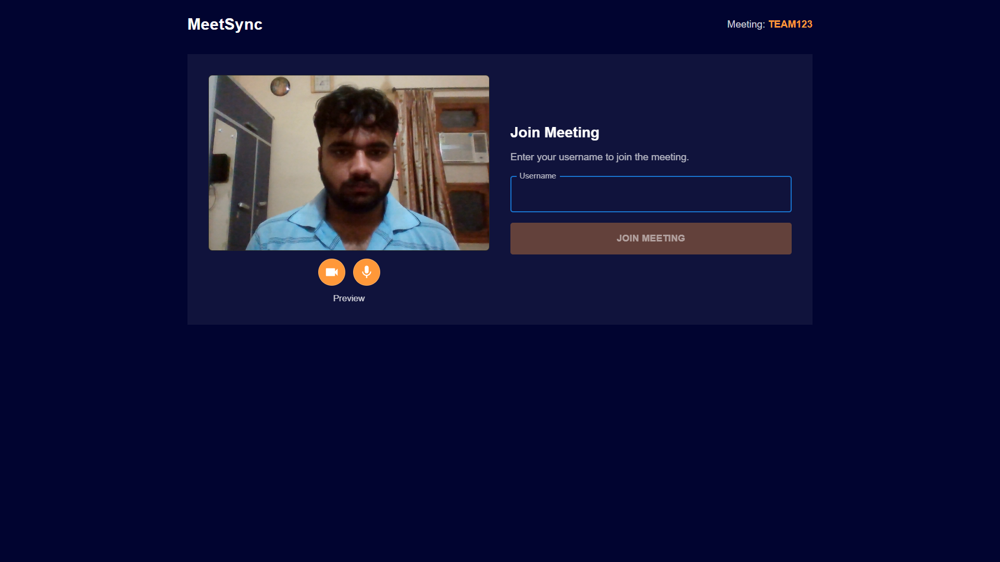
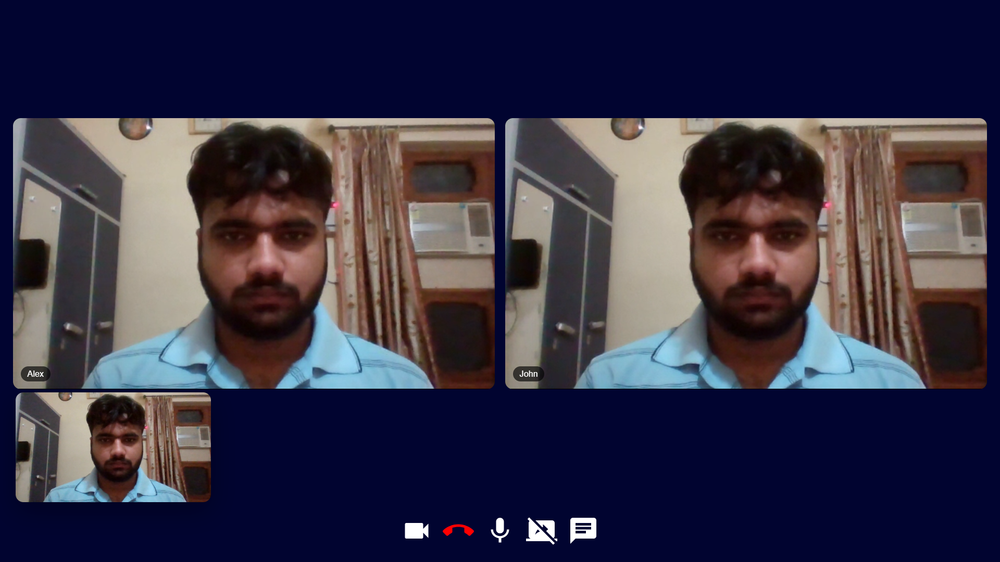
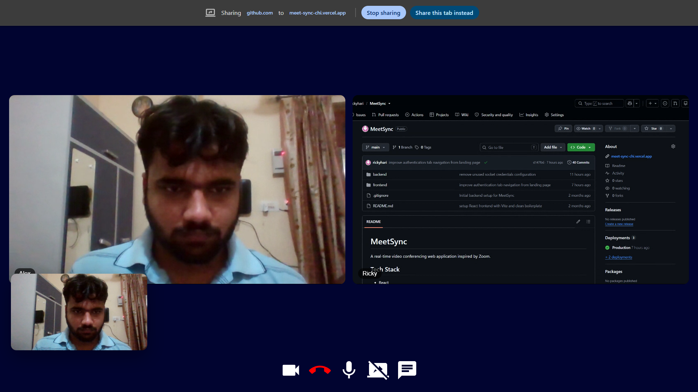
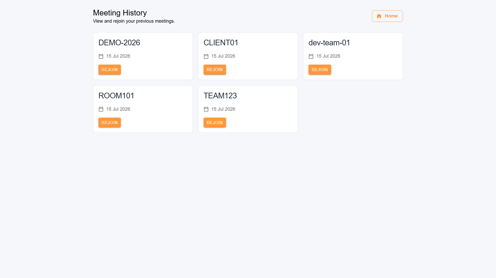

# MeetSync - A Real-Time Video Conferencing Platform

A full-stack real-time video conferencing platform inspired by **Zoom**, built with **React, Node.js, Express, WebRTC, Socket.IO, and MongoDB** featuring secure authentication, peer-to-peer video/audio communication, screen sharing, in-meeting chat, and meeting history.

🔗 **Live Demo:** https://meet-sync-chi.vercel.app

> **Note:** The backend is hosted on Render's free tier and may take **30–60 seconds** to wake up on the first request.

---

## ✨ Features

- Secure user authentication
- Join meetings using a meeting code
- Guest mode (join meetings without creating an account)
- Real-time video and audio communication
- Screen sharing
- In-meeting text chat
- Camera and microphone controls
- Meeting history for authenticated users
- Rejoin previous meetings from meeting history
- Responsive meeting lobby
- Responsive video conference layout

---

## 📸 Screenshots

### 🏠 Landing Page


### 🔐 Authentication (Sign In / Sign Up)


### 🏠 Meeting Dashboard


### 🎥 Meeting Lobby


### 👥 Video Conference


### 🖥️ Screen Sharing


### 🕒 Meeting History


---

## 🛠️ Tech Stack

### Frontend
- React
- Vite
- Material UI
- CSS Modules

### Backend
- Node.js
- Express.js
- Socket.IO

### Database
- MongoDB
- Mongoose

### Real-Time Communication
- WebRTC
- Socket.IO
- Google STUN Server

---

## 📁 Project Structure

```
MeetSync
│
├── backend
│   ├── controllers
│   ├── models
│   ├── routes
│   └── app.js
│
├── frontend
│   ├── src
│   │   ├── components
│   │   ├── contexts
│   │   ├── pages
│   │   ├── styles
│   │   └── utils
│   └── public
```

---

## ⚙️ Environment Variables

### Backend (.env)

```
PORT=8000
MONGO_URL=your_mongodb_connection_string
```

### Frontend (.env)

```
VITE_SERVER_URL=http://localhost:8000/api/v1/users
```

> **Production:** Update `VITE_SERVER_URL` to your deployed backend URL.

---

## 🚀 Installation

### Clone the repository

```bash
git clone https://github.com/rickyhari/MeetSync.git
```

### Backend

```bash
cd backend
npm install
npm run dev
```

### Frontend

```bash
cd frontend
npm install
npm run dev
```

---

## 🌐 Deployment

| Service | Platform |
|---------|----------|
| Frontend | Vercel |
| Backend | Render |
| Database | MongoDB Atlas |

---

## 🔒 Authentication

MeetSync uses a lightweight token-based authentication system.

- Secure login & registration
- Authorization header for protected requests
- Session storage based authentication
- Guest users can join meetings without signing in
- Meeting history is available only for authenticated users

---

## 📡 How It Works

1. User joins a meeting.
2. Socket.IO establishes signaling between participants.
3. WebRTC creates peer-to-peer connections.
4. ICE candidates are exchanged.
5. Audio and video streams are exchanged directly between peers.
6. Chat messages are exchanged through Socket.IO.
7. Meeting history is stored for authenticated users.

---

## 📚 Key Learnings

- Built a real-time communication system using WebRTC and Socket.IO.
- Learned peer-to-peer media streaming and signaling workflows.
- Implemented token-based authentication and protected routes.
- Deployed a full-stack application using Vercel, Render, and MongoDB Atlas.
- Improved application usability through responsive UI and iterative UX refinements.

---

## 🚀 Future Improvements

- TURN server support
- Waiting room
- Meeting passwords
- Secure invite links
- Meeting recording
- Virtual backgrounds

---

## 👨‍💻 Author

**Ricky Hari**

- GitHub: [@rickyhari](https://github.com/rickyhari)
- LinkedIn: [@rickyhari](https://linkedin.com/in/rickyhari)